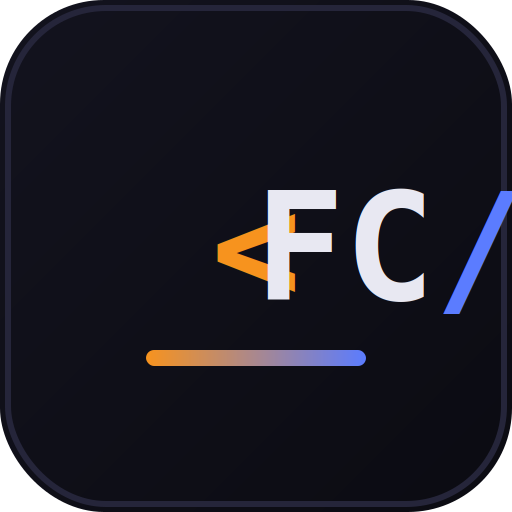

<p align="center">
  
</p>

<h1 align="center">Funkin' Coding</h1>

<p align="center">
  A code generator, script library, and live community hub for Friday Night Funkin' engine modders — built for <b>Psych Engine</b> and <b>V-Slice</b>.
</p>

---

## Features

| Tab | What it does |
|---|---|
| **Generator** | Form-driven generator with 24 categories (beat/note hooks, camera effects, health, HUD, keybinds, Discord presence, and more). Output switches between Psych Engine's flat function style (HScript or Lua) and V-Slice's `Module`-class API depending on the engine selector. |
| **Cartridges** | A library of ready-to-use full scripts — copy-paste snippets and complete Modules — for both engines. |
| **Tutorials** | Short written guides: HScript vs Lua, the script lifecycle, reading chart events, custom notes, and debugging tips. |
| **AI Assistant** | Free-form chat that writes code (or just answers questions) in the style of whichever engine/language is currently selected. |
| **Characters** | Builds a character JSON file in the exact shape each engine expects (Psych's `animations`/`healthicon`/`healthbar_colors` format, or V-Slice's `renderType`/`assetPath`/`cameraOffsets` format), with an editable animation list. |
| **Community** | A live chat bar for people using the site to talk to each other, backed by `server.js`. |

The **ENGINE** switch (Psych Engine / V-Slice) at the top controls the Generator, Cartridges, AI Assistant, and Characters tabs together. Picking V-Slice hides the Lua option, since V-Slice only scripts in Haxe.

The site is also an installable **PWA** (manifest + service worker, offline shell caching) and supports **Google Sign-In**.

## Project structure

```
index.html              the whole front-end (markup, styles, all client logic)
login.js                Google Sign-In (Google Identity Services)
community.js             WebSocket client for the Community tab
server.js                Express static server + WebSocket server for community chat
package.json             server dependencies (express, ws)
manifest.json            PWA manifest
sw.js                    service worker (offline caching, cache-busted per version)
icons/                   app icons (16/32/180/192/512px)
community-messages.json  chat history, created automatically by server.js
```

## Getting started

```
npm install
npm start
```

Then open `http://localhost:3000`.

`server.js` does two jobs:
- Serves the site itself as static files.
- Runs a WebSocket endpoint at `/ws/community` that powers the Community tab. Messages broadcast to everyone connected and persist to `community-messages.json`, so history survives a restart. The 200 most recent messages are kept; each message is capped at 500 characters.

## Configuration

### Google Sign-In

`login.js` needs a real Google OAuth Client ID. Open that file and replace:

```js
const GOOGLE_CLIENT_ID = 'YOUR_GOOGLE_CLIENT_ID.apps.googleusercontent.com';
```

Get a Client ID from the [Google Cloud Console](https://console.cloud.google.com/apis/credentials) → **Create Credentials → OAuth Client ID → Web application**, and add your deployed domain (e.g. `https://yoursite.com`, no trailing slash) to that credential's **Authorized JavaScript origins**. If the OAuth consent screen is still in "Testing" mode, only accounts added as test users can sign in.

Signed-in users show their Google name/avatar in the header and in Community chat messages; anyone not signed in chats as a random `Guest####` name (stored in `localStorage`).

### AI Assistant — known limitation

The AI Assistant tab calls `api.anthropic.com` directly from the browser. That works inside Claude.ai's own artifact preview (which attaches credentials transparently), but **it will not work once this site is hosted on its own domain** — there's no API key wired up, and the Anthropic API isn't meant to be called directly from an arbitrary browser origin.

To make the AI Assistant work in production, add a small proxy route to `server.js` that holds your own Anthropic API key server-side (e.g. `POST /api/ai` → forwards to `api.anthropic.com/v1/messages` using `process.env.ANTHROPIC_API_KEY`) and point the front-end fetch at that route instead. This isn't wired up yet.

## Deploying

This is no longer a static-only site — the Community tab needs a real running Node process for its WebSocket server, so plain static hosts (GitHub Pages, Netlify's default static hosting, etc.) won't run `server.js`. Use a host that runs long-lived Node processes: Render, Railway, Fly.io, a VPS, and similar all work.

Set the `PORT` environment variable if your host requires a specific port; it defaults to `3000`.

## Customizing

- **Add a Generator category:** add an entry to the `schema` object and a matching case in `generate()` (Psych) / `generateVSlice()` (V-Slice) in `index.html`.
- **Add a Cartridge:** add an object (`lang`, optional `engine`, `title`, `tag`, `desc`, `code`) to the `cartridges` array.
- **Add a Tutorial:** add an entry to the `tutorials` array (title + HTML body).
- **Change the icon:** replace the files in `icons/` (keep the same filenames/sizes: 16, 32, 180, 192, 512) — `manifest.json` and the `<link>` tags in `index.html` already point at them.

## Notes

- The service worker (`sw.js`) uses network-first for `index.html` and cache-first for everything else, and auto-activates new versions (bump `CACHE_VERSION` in `sw.js` whenever you change any precached file, or visitors may keep seeing a stale cached copy).
- WebSocket connections aren't intercepted by the service worker, so Community chat always needs a live network connection — there's no offline chat.
